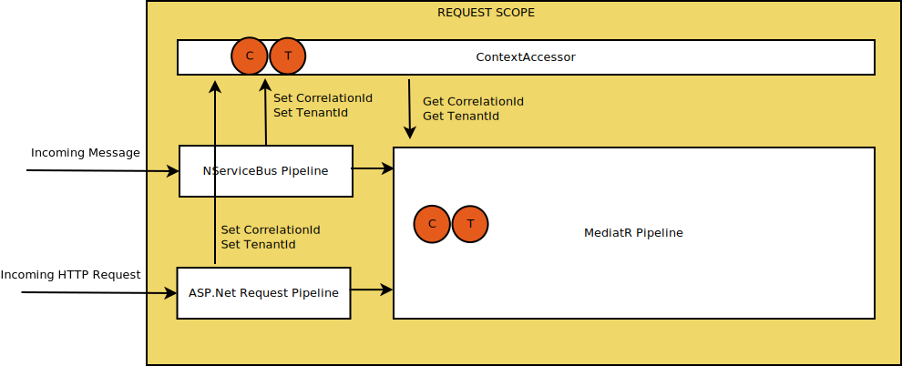

# ADR-0007: CorrelationId and TenantId in Message Headers

Date: 2020-04-24

## Status

Accepted

## Context

When domain events are being published to the bus, we are injecting the contextual information, such as `CorrelationId` and `TenantId`,  into the event object. However, some of these values are non-related to the domain. Especially `CorrelationId` is strictly infrastructure concern.

The common pattern as of the writing of this ADR is to have properties in the event objects to hold these values, through leaky abstraction. As a result, these contextual information are included in message content, but not in message headers. This strategy has a few drawbacks: 

* It pollutes the domain events with concerns that are foreign to their respective domain. 
* It is harder to create behaviors, since they would require information from the message content.
* It is harder to extend contextual information, since it requires changing domain events.

We propose to have those values sent as message headers, instead of the message content.

## Decision

We will send the contextual information such as `TenantId` and `CorrelationId` in message headers. We will also use these headers to have them in context when handling messages.

Injection of context values are accomplished through code that runs in the request handling pipeline (for web requests) and message handling pipeline (for incoming messages). Following diagram summarizes this.

`ContextAccessor` helps utilize this injection by holding values that are set in the scope.

## Consequences

* Domain events will purely be related to the domain. No foreign contructs.
* It will be easier to create infrastructure functionality. One such functionality is to carry over the correlation id when handling messages from the bus.
* It will be simpler to extend contextual information without having to change the domain events.
