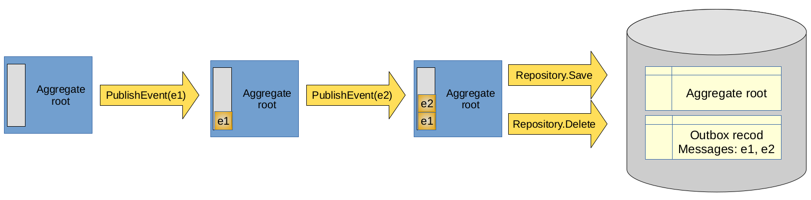

# ADR-0009: Capturing and publishing domain events

Date: 2020-05-01

## Status

Accepted

## Context

Changes to the aggregate root's state in the domain are captured with an event, which is then published to the service bus to allow for integration. We have already decided that each domain event should be published to the service bus and that we should not use commands (targeted queueing) unless it's absolutely necessary. We have, however, diverged on the details of the implementation for capturing domain events. [ADR-0003: Implement the Outbox Pattern for Web Requests](./adr-0003-implement-outbox-on-web-requests.markdown) required us to work with capturing domain events, where we used an alternative approach to what we have previously considered.

This ADR will outline the options that we have considered and implemented in chronological order and explain our decision for the approach taken in [ADR-0003](./adr-0003-implement-outbox-on-web-requests.markdown). The class/interface names used could be slightly different in the git history, but we will overlook that in the ADR for brevity.

Before getting into details, we should state a few points that will help with reader's perspective:

* The class/interface names mentioned for each approach might not be exact, but similar in spirit. We tried to use names to help reader understand the approach without having to map the nomenclature.

* Generally, all approaches use two phases: Publish and Dispatch. The former aggregates the events in-memory while the latter handles the mechanics of sending it. With [ADR-0003](./adr-0003-implement-outbox-on-web-requests.markdown), the Dispatch phase has changed into saving to outbox. The respponsibility of sending messages moved to a background job. Since this detail doesn't change the approaches mentioned here, we will just assume the Dispatch phase saves to the outbox table. 

* All approaches had to address this challenge: No dependency injection container is used in domain layer. Only simple POCOs.

### 1. Double dispatch on aggregate root methods

The very first implementation of domain events used a double dispatch approach. It defined an interface, `IPublishEvents`, which had a method `PublishEvent`, which aggregated all events into an in-memory queue. Each method on the aggregate that publishes an event accepted a parameter `publisher` that implements this interface and called `publisher.PublishEvent(eventObject)`.

Following example shows a scenario of updating a greeting message:

```csharp
// In PutGreetingCommandHandler.Handle(PutGreetingCommand request)
// Assuming IPublishEvents publisher in the context.
greeting.UpdateMessage(request.Message, publisher);

// ---

// In Greeting.UpdateMessage(string newMessage, IPublishEvents publisher)
publisher.PublishEvent(new GreetingMessageChanged(greetingId, oldMessage, newMessage));
```

A pipeline behavior ensures that all events in the queue are saved to outbox.

Pros:
* Straightforward implementation.

Cons:
* Need to supply publisher to all methods
* Harder to test domain objects, because the publisher needs to be mocked.


### 2. Ambient publisher using AsyncLocal

This implementation used a static `DomainEvents` class which used `AsyncLocal` members to maintain an in-memory list of domain events. The aggregate root used a method on this static class to publish its events, like `DomainEvents.PublishEvent(eventObject)`.

A pipeline behavior ensures that all events in the queue are saved to outbox. The behavior used another method on the `DomainEvents` static class, like `DomainEvents.DispatchEvents()`.

Pros:
* Less clutter. Aggregate root methods don't need to be supplied with a publisher.
* Centralized in-memory queue of events.

Cons:
* Complex implementation.
* Usage of AsyncLocal created concerns for unforeseen concurrency bugs.

### 3. Aggregate root maintaining in-memory list and Repository saving to outbox.

This implementation put the responsibility of maintaining in-memory list of events on the aggregate root itself. When aggregate root is saved or deleted, the repository also saves the events from the aggregate root into the outbox table. In order to help with this process, all aggregate roots derive from the `AggregateRootBase` class, which has a protected `PublishEvent` method. Following image depicts the process:



Pros:
* Simpler implementation.
* Events are always collected and saved with the aggregate. No need for a mediatR behavior.

Cons:
* Additional members on the aggregate root for managing the event queue.

### 4. Injected publisher in the aggregate root

This approach is a variation of 1, where instead of publisher being supplied to each method on the aggregate, it is injected into the aggregate. A few variations of this injection could also be considered, like using a delegate or `Action<IDomainEvent>` member on the aggregate root.

When an aggregate is created or read from repository, the publisher needs to be injected in before any methods are used.

Pros:
* Simple implementation.
* No need to provide publisher to each method.

Cons:
* If any method that needs to publish event is called before the publisher is injected, there will be loss of some events.

## Decision

We have decided that option 3 provides the most beneficial approach, since it has a simple imlementation and forces events being saved with the aggregate. We have used an explicit interface implementation and private members in the `AggregateRootBase` base class to hide the details from aggregate roots. Following code shows this base class:

```csharp
    public class AggregateRootBase : IHaveEvents, IAggregateRoot
    {
        private readonly Queue<IDomainEvent> events = new Queue<IDomainEvent>();

        IEnumerable<IDomainEvent> IHaveEvents.Events => events.ToArray();

        public abstract string Key { get; }

        void IHaveEvents.PurgeEvents()
        {
            events.Clear();
        }

        /// <summary>
        /// Adds an event to the events list to be published during save or delete.
        /// </summary>
        /// <param name="event">Event to publish.</param>
        protected void PublishEvent(IDomainEvent @event)
        {
            events.Enqueue(@event);
        }
    }
```

#### Consequences

* Domain events are captured and saved together into the database.
* Events are always captured. No loss of events.
* Aggregate root objects need to derive from `AggregateRootBase`.
* Repository has the responsibility of saving the events to outbox table.
