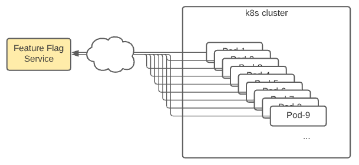
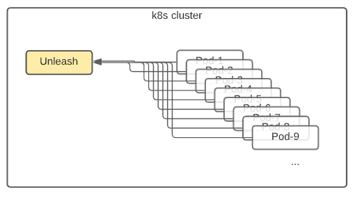
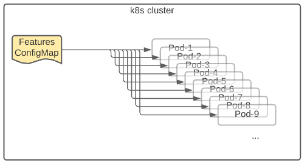

# ADR-0020: Feature flags

Date: 2021-08-17

## Status

Proposed

## Context

Feature flags are helpful for many reasons including the ability to hide new features and separate deployment from release. With that capability at hand, we will be able to deploy new features into production without turnning them on. We can then turn them on only for a targeted set of users to get their feedback. That way, we can also test whether everything is working on production before releasing the feature. It will improve our confidence on the features we release, since they would already be deployed and reviewed on the production environment.

### Options for implementing feature flags

#### Option 1. Feature flag services, like LaunchDarkly, split.io, or Flagship

We could use services of an external service provider that specialize on feature flags. The following diagram shows how that will more or less look like. 

Each pod will have the featue flag client built in. At regular intervals, they will pull the latest changes from the central service. When handling requests, each pod will decide whether the feature is enabled or disabled using the definition retrieved from the central service.

Pros:

* Offloading responsibility of keeping the service up.
* SDK support for wider array of languages.
* Ready-made UIs for configuring feature flags.
* Ready-made usage statistics for features.

Cons:

* Polling for features increases network traffic.
* Cost of service
  * LaunchDarkly starting at 10$ user/month
  * Flagship.io at $175/month
* Vendor lock-in or hardship of moving data
* Limited support for git-ops.

#### Option 2. Deploying an Unleash service on the cluster

Unleash is an open source project with OCR images published in docker hub. We could create a deployment in our Kubernetes cluster that uses this image and provide the feature services to the rest of the cluster.

Pros:

* SDK support for most popular languages.
* Ready-made UIs for configuring feature flags.
* No up-front costs, other than the cost of operations.
* No vendor lock-in.
* Ready-made usage statistics

Cons:

* Polling for features increases network traffic
* Cost of operations
  * Compute, storage, and maintenance.
* Limited support for git-ops

#### Option 3. Using Kubernetes ConfigMaps

With this method, we create a configmap YAML definition in our cluster's GitOps repository (Mercury.PreProd or Mercury.Production). Kubernetes mounts that configmap as a volume to each pod, which then reads the JSON-structured feature definition. This follows our GitOps workflow, where every change is auditable and reviewed by at least one more person.

When we need to modify the feature definitions, we can follow the git-ops workflow:

* Update the feature definitions in configmap YAML.
* Create a pull request.
* Merge the pull request.
* Configmap gets applied to the cluster.
* Kubernetes updates each pod with the new configmap.
* POD gets notified of the change and reads the new feature definitions.

There are plans to follow a similar approach for loading secrets, when we move onto vault.

The following diagram attempts to picture how this will work:

Pros:

* No up-front cost.
* No operation costs.
* No additional network traffic. Updates are pushed to pods by Kubernetes.
* Always fresh. Less than 2 minute delay by default. (See https://kubernetes.io/docs/tasks/configure-pod-container/configure-pod-configmap/#mounted-configmaps-are-updated-automatically)
* Simple and easy to start.
* Easy to replace.
* Git-ops based, since configmap will be managed in cluster's git repository.

Cons:

* No SDK support. This might not be as important, since implementation it's just readding a JSON file. Easy enough to implement in any language.
* No UI for flag management.
* No ready-made statistics. Need to configure them through Datadog.

## Decision

We have decided to go with option 3, using the config maps. It requires the least investment and a simple start. We could re-evaluate as we have more use cases, in which case the removal will not be as hard.

## Consequences

* The proof of concept implementation will be hardened with tests and implemented in dotnet 5 template.

* A configmap will be created in hawking and bethe cluster to have the feature definitions.

* Another ADR needs to be created for best practices. It should provide guidance for:

  * When to create a new feature.

  * When to remove a feature.

  * Strategies to minimize code impact of the feature checks.
