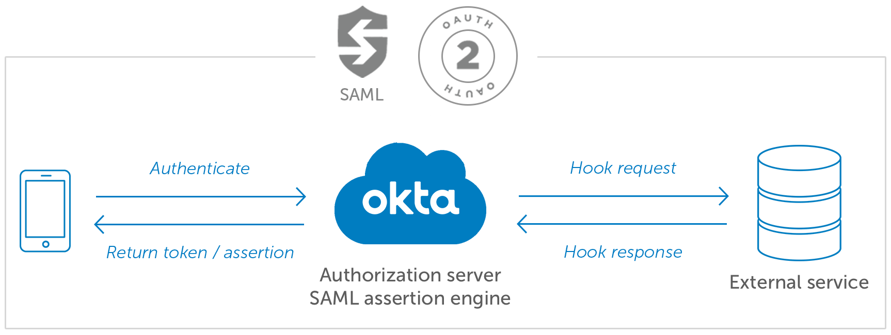

# ADR-0022: Angular Route Guard for Legal Consent

Date: 2022-05-09

## Status

Approved

## Context

Legal has determined that in order to protect GSFS from lawsuits involving the use of sensitive information end users need to agree to a EULA. Before users can accept the EULA, they first need to agree to electronic transactions in general. Only then can they read and accept the EULA to proceed.

#### Options

1. Add acceptance of electronic documents and the EULA into Okta's authentication flow.

   #### Okta Hooks

   Hooks enable developers and IT teams to modify flows or quickly integrate other systems with custom code running on any cloud or infrastructure. Hooks also enable organizations to create unlimited custom integrations for the Okta Integration Network. From adding identity proofing and verification into consumer registration decisions to customizing employee account creation flows, Hooks delivers advanced integration options by providing significant latitude for developers to customize and extend the reach and breadth of the Okta Identity Cloud.

   

   | PROS                                                         | CONS                                                         |
   | ------------------------------------------------------------ | ------------------------------------------------------------ |
   | Works outside the application preventing manipulation.       | Tightly coupled to Okta.                                      |
   | Works across shells as long as they all use Okta for authentication | The likelihood of GSFS moving away from Okta is slim, but it isn’t reusable unless everyone using our application authenticates in Okta (that is if we ever sell it as a product for other companies to consume with their own authentication provider).                       |
   |                                                              | We cannot assume every tenant would be using Okta.            |
   |                                                              | If we decide we need to secure individual micro services this would not be possible with this solution. |

   

2. Add acceptance to the micro app component within the shell.

   | PROS                                                         | CONS                                                         |
   | ------------------------------------------------------------ | ------------------------------------------------------------ |
   | Easier to create a EULA per service.                         | More frustrating for end users since they might have to accept more than one EULA. |
   | Compartmentalized to terms of service and independent of the shell. Reusable by other applications/shells. | It is cumbersome to work with. It can cause a lot of confusing loop-back scenarios. Once completed, maintainability would be more difficult. |
   
   
   
3. Add a route guard to the shell that once added to any route requires that the user has accepted all of the required documents associated with a shell per tenant before displaying the requested page.  If the result is false then the user is routed to a license consent component and the originally requested page is stored for after they accept. If the result is true then that response is cached within the client and used for all future checks by the legal consent route guard in order to reduce traffic as the user navigates within RedLine.

   | PROS                                                         | CONS                                                         |
   | ------------------------------------------------------------ | ------------------------------------------------------------ |
   | Able to restrict route navigation easily using functionality built into Angular's Router | Each shell application that implements this TOS practice will have to code a Route guard or we need to add it to a NPM package. |
   | The shell is aware of the TOS it needs to use because it is itself the application using that TOS. | Only restricts the client but API's can still be called without verification. |
   

## Decision

A route guard was added to the shell that protects all of the routes to microservices available within a shell.  

## Consequences

* All routes using the RedLine shell, within the GSFSGroup tenant, must agree to our EULA.
* Because we based the decision of which document collection to load on the shell being utilized the EULA has to encompass use of all the RedLine services instead of per service.
* We can provide EULAs per tenant.
* We can provide other documents in similar flows for things other than EULAs at login via the consent service.
* The use of a route guard only applies to the UI and thus APIs do not require users to agree. Since it is not super secure a sophisticated user could get past it.
